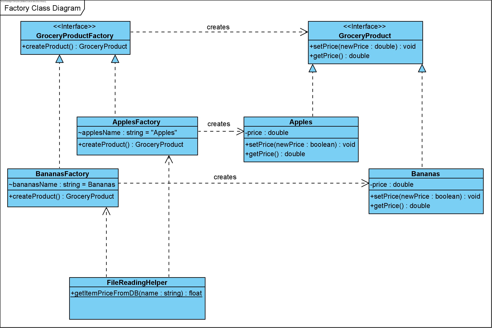

## Software Design & Architecture | SOFE3650
##### Assignment #1

Name: **Jason Manarroo** | Student Number: **100825106**

### UML Diagram of Abstract Factory _(With Bananas & Apples as examples)_

### TestDriver2.java Output:

### Assignment File Structure:

─|  /Assignment_1

─|─|  /bin      *(Compiled source files, mirror folder structure like src, but with .class files)*

─|─|  /src      *(Source files, .java)*

─|─|─|  data.txt        *(Data File, holding product names & prices)*

─|─|─|  TestDriver2.java    *(Test Driver, which uses abstract factory)*

─|─|─|  /abstractfactory

─|─|─|─|  GroceryProductFactory.java

─|─|─|─|  GroceryProduct.java

─|─|─|─|  Apples.java

─|─|─|─|  Bananas.java

─|─|─|─|  ApplesFactory.java

─|─|─|─|  BananasFactory.java

─|─|    /.settings *(IDE settings & configs)*

─|─|    .classpath

─|─|    .project
