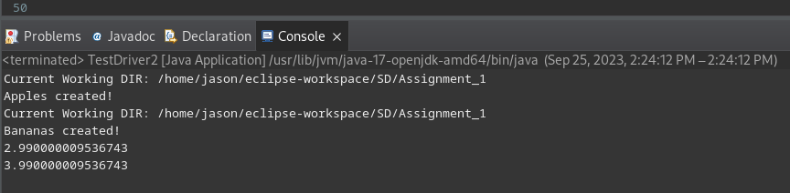

## Software Design & Architecture | SOFE3650
# Assignment #1

Name: **Jason Manarroo** | Student Number: **100825106** <br></br>
Name: **Trent Jordan** | Student Number: **100831853** <br></br>
Name: **William Chamberlain** | Student Number: **100846922**

---

### Project Setup:

Ideally, do this in a directory, but don't do it in your home directory!

```
git clone https://github.com/jasonmzx/Assignment1_SOFE3650U.git

cd Assignment_1/src/

javac *.java

java TestDriver2
```


---

### UML Diagram of Abstract Factory _(With Bananas & Apples as examples)_


### General Implementation & Driver Code | Notes:

> data.txt
```
Bananas 3.99
Apples 2.99
Cucumbers 4.99
```

> TestDriver2.java
```java
import abstractfactory.ApplesFactory;
import abstractfactory.BananasFactory;
import abstractfactory.GroceryProduct;
import abstractfactory.GroceryProductFactory;

public class TestDriver2 {
	
	public static void main(String[] args) {
		
		//Debug to know which directory Java is referencing upon file read
		//Definitions of concrete factories:
		GroceryProductFactory AF = new ApplesFactory();
		GroceryProductFactory BF = new BananasFactory();
		
		//* Create Apples
		GroceryProduct apples = AF.createProduct();

		//* Create Bananas
		GroceryProduct bananas = BF.createProduct();
		
		System.out.println(apples.getPrice());
		System.out.println(bananas.getPrice());	
	}
}
```

Our abstract factory interface `GroceryProductFactory` is implemented via `ApplesFactory` & `BananasFactory`. These two factory implementations utilize the `FileReadingHelper` class to read the price of a specific item from **data.txt**, and set the price. Upon using the price getter in our Driver code, we can see the price got correctly set *(view output)*. Upon creation of product using *createProduct()* method which is declared in our Abstract Factory, and implemented differently in our derived instanciable factories *(Implementations of the Abstract, for different "variations" of our `GroceryProduct`)*.


### TestDriver2.java Output:



--- 

### Assignment File Structure:

```
─|  /Assignment_1
─|─|  /bin      *(Compiled source files, mirror folder structure like src, but with .class files)*
─|─|  /src      *(Source files, .java)*
─|─|─|  data.txt        *(Data File, holding product names & prices)*
─|─|─|  TestDriver2.java    *(Test Driver, which uses abstract factory)*
─|─|─|  /abstractfactory
─|─|─|─|  GroceryProductFactory.java
─|─|─|─|  GroceryProduct.java
─|─|─|─|  Apples.java
─|─|─|─|  Bananas.java
─|─|─|─|  ApplesFactory.java
─|─|─|─|  BananasFactory.java
─|─|─|─|  FileReadingHelper.java *Abstract class that helps our factories*
─|─|    /.settings *(IDE settings & configs)*
─|─|    .classpath
─|─|    .project
```
